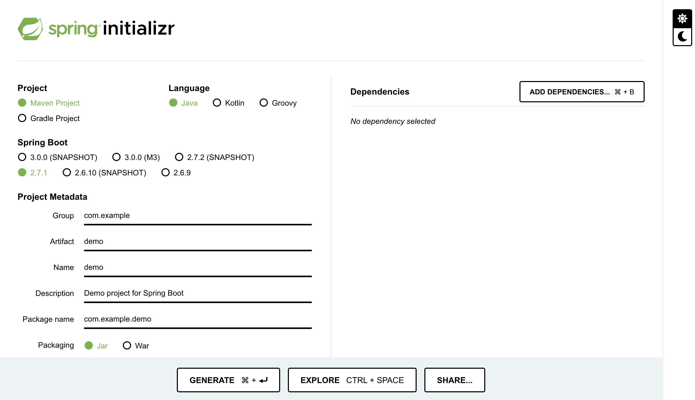

# SpringBoot-and-Rest-API
Steps to Run this project.

step1. -> Go to https://start.spring.io/ and choose requirements according to your project. 
Step2. -> Add Dependencies, web,mysql,jpa  

 
Step3. -> Opne IDE and open this project with maven  
### It will automatically add all the dependencies in your project directory.

Now run main file 
SpringrestApplication.java  

Path = src/main/java/com/spring/springrest/

##### Now you can Create,Update,delete,modify according to your need.

